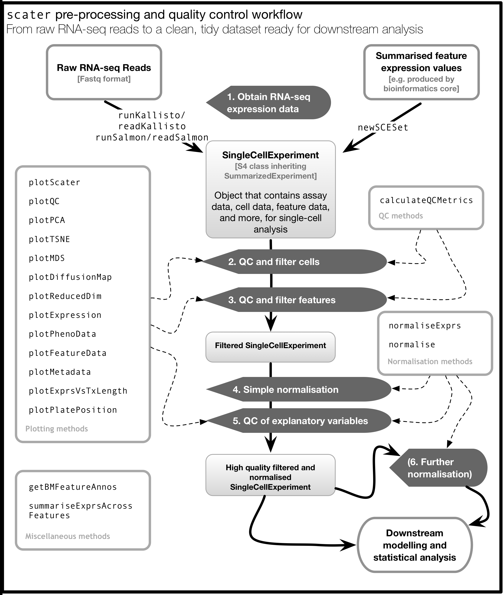

# scater: single-cell analysis toolkit for expression with R

[](https://travis-ci.org/davismcc/scater)
[](https://codecov.io/github/davismcc/scater?branch=master)
[](https://ci.appveyor.com/project/davismcc/scater-winnf)
<!--- [](https://travis-ci.org/davismcc/scater) --->


This package contains tools for the analysis of single-cell
gene expression data using the statistical software R. The package places an
emphasis on tools for quality control, visualisation and pre-processing of data
before further downstream analysis.

We hope that `scater` fills a useful niche between raw RNA-sequencing
count or transcripts-per-million data and more focused downstream
modelling tools.

Briefly, `scater` enables the following:

1. Automated computation of QC metrics
1. Transcript quantification from read data with pseudo-alignment
3. Rich visualisations for exploratory analysis
4. Seamless integration into the Bioconductor universe using the `SingleCellExperiment` class
5. Simple normalisation methods and tight integration with the [`scran`](https://bioconductor.org/packages/devel/bioc/html/scran.html) package.

See below for information about installation, getting started and highlights of the package.

## Installation

### Installation from Bioconductor (recommended)
The `scater` package has been accepted into Bioconductor!
Thus, the most reliable way to install the package is to use the usual
Bioconductor method:

```{R}
## try http:// if https:// URLs are not supported
source("https://bioconductor.org/biocLite.R")
biocLite("scater")
```

The `scater` package has been available as a "release" version in
the Bioconductor since April 2016. The release version of `scater` works with 
the release version of R and Bioconductor, and development will continue in the 
devel version of the package on Bioconductor. Future releases will follow the 
regular Bioconductor release cycle.

Using the most recent version of R is strongly recommended (R 3.4 at the time
of writing). Effort has been made to ensure the package works with R >3.0, but
the package has not been tested with R <3.1.1.

There are several other packages from CRAN and Bioconductor that `scater` uses; 
installing through Bioconductor will install these packages as well.

The following optional packages are not strictly required but enhance the 
functionality of `scater`:

```{r}
install.packages(c("cowplot", "cluster", "mvoutlier", "parallel", "Rtsne"))
biocLite(c("destiny", "monocle"))
```

You might also like to install `dplyr` for convenient data manipulation:

```{r}
install.packages("dplyr")
```


## Getting started

The best place to start is the vignette. From inside an R session, load `scater`
and then browse the vignettes:

```{r}
library(scater)
browseVignettes("scater")
```

There is a detailed HTML document available that introduces the main features
and functionality of `scater`.

The [step-by-step workflow](https://f1000research.com/articles/5-2122/v2) offers
further examples of using `scater` and `scran` for low-level analysis of 
scRNA-seq data.

## `scater` workflow

The diagram below provised an overview of the pre-processing and QC workflow possible in `scater`, listing the functions that can be used at various stages. A first place to start is with the `newSCESet` function, which will allow you to create a data object for use with `scater`.




## Highlights

The `scater` package allows you to do some neat things relatively quickly. Some highlights are shown below with example code and screenshots.

1. Automated computation of QC metrics
1. Transcript quantification from read data with pseudo-alignment approaches
2. Data format standardisation
3. Rich visualisations for QC and exploratory analysis
4. Seamless integration into the Bioconductor universe
5. Simple normalisation methods

For details of how to use these functions, please consult the **vignette** and **package documentation**.  The plots shown use the example data included with the package (for which there is no interesting structure) and as shown require only one or two lines of code to generate.

### Automatic computation of QC metrics

Use the `calculateQCMetrics` function to compute many metrics useful for gene/transcript-level and cell-level QC. Metrics computed include number of genes expressed per cell, percentage of expression from control genes (e.g. ERCC spike-ins) and many more.

### Transcript quantification with `kallisto` or `Salmon`

The `runKallisto` and `runSalmon` functions provides wrappers to the [`kallisto`](http://pachterlab.github.io/kallisto) and ['Salmon'](https://combine-lab.github.io/salmon/) software for quantifying transcript abundance from FASTQ files using a "pseudo-alignment"" or "lightweight alignment" approaches. These new approaches are extremely fast while retaining accuracy. With `readKallistoResults` and `readSalmonResults`, transcript quantities can be read into a data object in `R`.

### Plotting functions

Default `plotScater` for an SCESet object gives cumulative expression for the
most-expressed features (genes or transcripts)

The `plotTSNE` function produces a t-distributed stochastic neighbour embedding
plot for the cells.

The `plotPCA` function produces a principal components analysis plot for the
cells.

The `plotDiffusionMap` function produces a diffusion map plot for the cells.

The `plotExpression` function plots the expression values for a selection of
features.

The `plotQC` function produces a variety of QC plots useful for diagnostics and
feature and cell filtering. It can be used to plot the most highly-expressed
genes (or features) in the data set or create density plots to assess the
relative importance of explanatory variables, as well as many other
visualisations useful for QC.

The `plotPhenoData` function plots two phenotype metadata variables (such as QC
metrics).

See also `plotFeatureData` to plot feature (gene) metadata variables, including QC metrics.

Plus many, many more possibilities. Please consult the vignette and documentation for details.

## Acknowledgements and disclaimer

The package leans heavily on previously published work and packages, namely
[edgeR](http://bioconductor.org/packages/release/bioc/html/edgeR.html) and
[limma](http://bioconductor.org/packages/release/bioc/html/limma.html). The
`SingleCellExperiment` class from the [SingleCellExperiment](http://www.bioconductor.org/packages/release/bioc/html/SingleCellExperiment.html)
package (new for Bioconductor 3.6+) provides a modern data 
structure to support single-cell analyses. `scater` has adopted this data 
structure from Bioconductor 3.6; wide adoption across Bioconductor will 
streamline analysis workflows using multiple packages.

The `scater` sticker is licensed under Creative Commons Attribution
[CC-BY](https://creativecommons.org/licenses/by/2.0/). Feel free to
share and adapt, but don't forget to credit the author. Skateboard icon made by 
[Nikita Golubev](http://www.flaticon.com/authors/nikita-golubev) from 
[Flaticon](http://www.flaticon.com) is licensed by [Creative Commons BY 3.0](http://creativecommons.org/licenses/by/3.0/).

We hope the `scater` package makes your life easier when analysing single-cell 
RNA_seq data. Please do try it and contact us with bug reports, feedback, feature
requests, questions and suggestions to improve the package.

Davis McCarthy, September 2017
(on behalf of `scater` authors and contributors)
